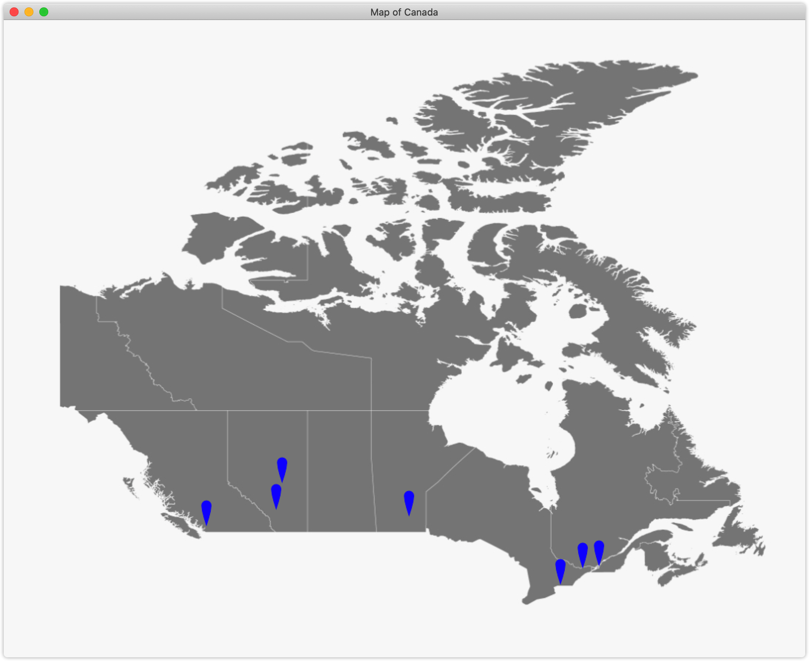
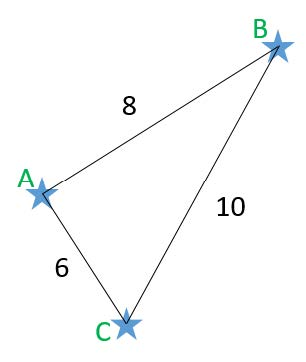
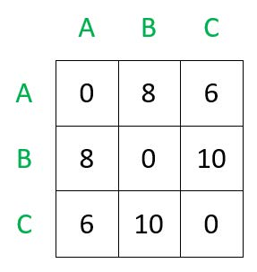
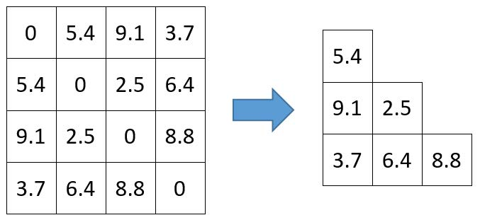

# CS1027 CS Fundamentals II - Assignment 1

A Java program for creating a visualization of Canadian cities. The input of the program is a text file; here is a glance at its format:

```text
city name,x,y
Calgary
367
661
Edmonton
375
625
Montreal
802
737
```

The following is the output we should get from the file ``./resource/cities1.txt``.



## Get Start!

As we can see on the proejct title, this is the first assignment of the course [CS1027](https://www.csd.uwo.ca/courses/CS1027b/). If you want to know more about the implementation, please keep reading over to the end of the file.

If you are cloning or forking this repository, this project's entry point is at the following path: ``root/luca_asn1/Program.java``. It is a console program. To run it, here are some file paths for your argument:

```text
    ./resource/cities1.txt
    ./resource/cities2.txt
    ./resource/cities3.txt
    ./resource/cities4.txt
    ./resource/cities5.txt
```

Else if you are only "stealing" some files from your assignment, please make sure you delete the package name and my name at the comment (Since I do not want to get involved in your grading ...). The purpose of this project is to showcase my work. If you overused my code, please don't tell me. Thanks.

Here is a sitemap for all the file in this project:

* root
  * luca_asn1
    * *.java
    * Test*.java
  * resource
    * *.(jpg | png)
    * cities[1-5].txt
  * .gitignore
  * Assignment1_instructions
  * README.md
  * LICENSE

## Learning Outcomes

To gain experience with

* Creating classes with simple methods
* Using linear arrays and multi-dimensional arrays
* Algorithm design

## Introduction

It is important in Computer Science to consider memory and to use compression to reduce the amount of memory being used by a program. A matrix in linear algebra is considered symmetric if it is identical to its transpose. In other words, the element at (i,j) is the same as the element at (j,i) for all i and j in the bounds of the matrix. The diagonal (the set of elements from the top-left corner to the bottom-right corner) is the reflection line. We can represent a matrix as a 2D array in Java and consider the array to be symmetric by the same definition as that of a matrix. For the purpose of reducing memory, we can cut out a roughly half the array since the elements are already stored in the other half of the array.

If we calculate the distances between various locations, a matrix or 2D array can be used to store the distances. For a set of n cities, the array would have n rows and n columns to contain all the distances between each pair of cities. However, this would be an example of a symmetric array since the distance between A and B is the same as the distance between B and A, and thus that distance would exist twice in the array. Similarly, the diagonal of the array would contain all zeroes since the distance between a city and itself is always 0. Due to these observations, we can compress the distance array by storing just the lower-left corner (all the elements below and to the left of the diagonal) rather than the entire array. This compressed array will still contain all the information needed to represent the distance between every pair of cities, but will not contain any unnecessary or redundant data. The Figures below help illustrate this concept more clearly.



Figure 1. An example of a map of 3 cities, A, B, and C, and the distances between them.



Figure 2. A matrix (2D array) representing the distances between each of the cities from the map in Figure 1 above.



Figure 3. Another example of a matrix (2D array) containing hypothetical distances between cities or objects (left), and the CompressedArray of the same matrix (right).

Assume an "original" 2D array has n by n elements. When compressing this into a CompressedArray structure, we want to only include the elements that are below and to the left of the diagonal, as illustrated in Figure 3. To determine the number of elements needed in the CompressedArray, take the number of the elements in the original array, and subtract the number of elements on the diagonal (this is also n) to determine the number of non-diagonal elements. However, this number also include the top-right triangle which should also be cut out. Divide this number by 2 to determine the number of elements in the lower-left triangle only.

## Provided files

The following is a list of files provided to you for this assignment. Please do not alter these files in any way.

* **CityMarker.java** – adds a city marker icon on the visual GUI
* **Map.java** – provides a visual GUI for the program
* **MyFileReader.java** – reads in text files
* **TestCompressedArray.java** – tests that CompressedArray is working
* **TestProgram.java** – tests that Program is working

## Classes to implement

For this assignment, you must implement 3 Java classes: City, CompressedArray, and
Program. Follow the guidelines for each one below.

In all of these classes, you can implement more private (helper) methods, if you want to, but you may not implement more public methods. You may **not** add instance variables other than the ones specified below. Penalties will be applied if you implement additional instance variables or change the variable types or modifiers than what is described here.

### City.java

This class represents each city that is loaded in from a text file. It is a simple class that just contains the city's name, x and y coordinates, and a CityMarker icon.

The class must have the following private variables:

* ``name`` (String)
* ``x`` (int)
* ``y`` (int)
* ``marker`` (CityMarker)

The class must have the following public methods:

* ``public City(String, int, int) [constructor]``
  * Takes in parameters for name, x, and y and assigns these values to the corresponding instance variables. The marker variable must also be initialized in this constructor as a new CityMarker object.
* ``public String getName()``
  * Returns name
* ``public int getX()``
  * Returns x
* ``public int getY()``
  * Returns y
* ``public CityMarker getMarker()``
  * Returns marker
* ``public void setName(String)``
  * Sets name
* ``public void setX(String)``
  * Sets x
* ``public void setY(String)``
  * Sets y
* ``public void setMarker(CityMarker)``
  * Sets marker
* ``public String toString()``
  * Returns the city name

### CompressedArray.java

This class represents the array that has been compressed from a matrix (2D array) into a linear array that excludes elements from the diagonal and any elements above or to the right of the diagonal. Only elements below or to the left of the matrix diagonal must be included in the CompressedArray.

The class must have the following private variables:

* ``origArraySize`` (int)
* ``array`` (double[])

The class must have the following public methods:

* ``public CompressedArray(double[][]) [constructor]``
  * Takes in a 2D double array (double[][]) which represents the "original array"
  * Initialize the linear double array (instance variable array) and copy the elements from the original array into this linear array so that it contains only the lower-left triangle elements of the original array (the elements to the left and below the diagonal). The elements from this triangle must be added to the CompressedArray in order from left to right and top to bottom.
  * Hint: Read the description near the top of this document to determine the required capacity for this CompressedArray.
* ``public int getLength()``
  * Returns the length of the new, compressed array
* ``public double getElement(int)``
  * Returns the element in the new, compressed array stored at the given index
* ``public boolean equals(CompressedArray)``
  * Checks equality between the two CompressedArray objects by checking if they have the same length and that all the elements are identical in the same order
* ``public String toString()``
  * Builds a string that contains the CompressedArray and formats it in a trianglular structure to look like the lower left corner of a matrix. Each element should take up exactly 8 characters and show 2 decimal places.
  * Hint: Use String.format("%8.2f", element) for each element and remember to add a newline at the correct places

### Program.java

This class, as its name suggests, will be the main heart of the program. It will be the entry point of the program, read in a file of cities and create objects for each of them, contain the array of those cities, and create a CompressedArray containing the distances between each of the cities read in from the file.

The class must have the following private variables:

* ``cityCount`` (int)
* ``cityArray`` (City[])
* ``array`` (CompressedArray)

The class must have the following methods:

* ``public Program(String, boolean) [constructor]``
  * Takes in a String representing the file to load (i.e. "cities1.txt") and a boolean (showMap) that indicates whether or not the map GUI should be displayed
  * Initialize cityArray with 3 cells
  * Create an object of MyFileReader or use your own code to read in a text file, and load in the file with the given name.
  * Read in each line from the file and create a City object containing the city name, and the x and y values from the file (look at the text file to see this format). Add the city object to the cityArray and expand the capacity if needed.
  * If the boolean (showMap) is true, then create a Map object and call addCity() on the Map object for each city in the cityArray. This will add the marker icons to the map for each city.
* ``public City[] getCityList()``
  * Returns cityArray
* private void expandCapacity()
  * Expands the capacity of cityArray by adding 3 additional slots to the array
* ``public double distBetweenCities(City,City)``
  * Calculates the Euclidean distance between the two given Cities
* ``public void compareDistances()``
  * Create a 2D double array (i.e. double[][]) with a size of N by N, where N is the number of cities in cityArray. Loop through every combination of pairs of cities and call distBetweenCities() for each pair. Save this result into the double[][] array in the appropriate cell.
* ``public CompressedArray getArray()``
  * Returns array
